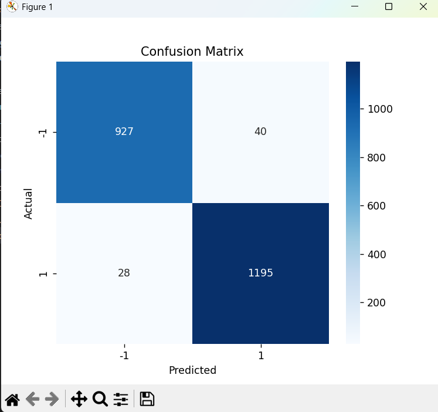
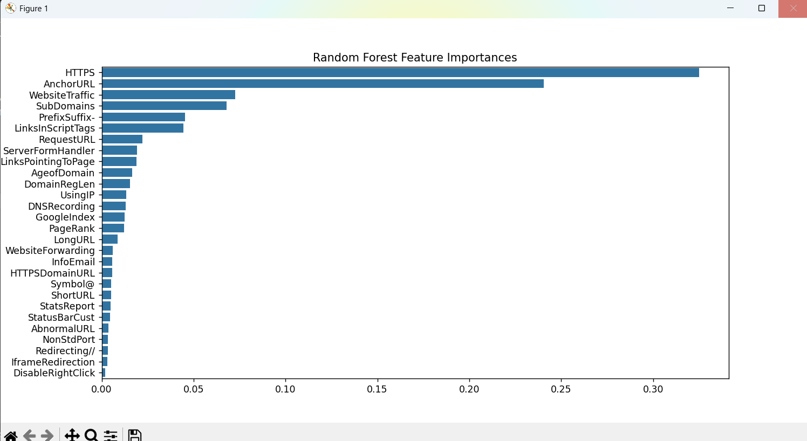

# Phishing Website Detection Report  
**Author:** Abdulrahman Assi  
**ID:** 212371421  

---

## 1️⃣ Description

We chose the **Phishing Website Dataset** from Kaggle because it is directly relevant to cybersecurity — an increasingly important field that affects everyone. This dataset contains features extracted from real websites and aims to classify whether a given website is legitimate or a phishing attempt.

This project is interesting because it shows how various small attributes (like the presence of an IP address, abnormal URLs, or HTTPS usage) can reveal malicious intent. Analyzing these features can help improve digital safety and deepen understanding of online threats.

---

## 2️⃣ System Stage – Phishing Website Dataset

- **File name:** phishing.csv  
- **File size:** Approximately a few MB  
- **File type:** CSV (Comma-Separated Values)  
- **Source:** Kaggle - Phishing Website Detector  
- **Protocol:** Downloaded via HTTPS  
- **Versioning:**  
  - Only one file provided; no formal versions  
  - Project version control is managed via Git  

---

## 3️⃣ Metadata

- **Data Types:**  
  All features are binary (0 or 1), with the target column named `class`:  
  - `1` = legitimate website  
  - `-1` = phishing website  

- **Missing Values:**  
  No missing values were found in this dataset. All rows are complete and usable for modeling.

- **Special Values:**  
  No special placeholder values (like “unknown” or -999) were found. The data is clean and well-formatted for direct use in machine learning.

---
Feature Explanation for Phishing Website Dataset
Feature Name	Description
Index	A unique identifier or serial number for each sample (not used in modeling).
UsingIP	Whether the website URL uses an IP address instead of a domain name (1 = yes, -1 = no). Using IPs in URLs is suspicious.
LongURL	Whether the URL is unusually long (1 = yes, -1 = no). Phishing URLs often use long, confusing URLs.
ShortURL	Whether the URL is suspiciously short (1 = yes, -1 = no). Can be a phishing tactic to hide malicious parts.
Symbol@	Presence of '@' symbol in URL (1 = yes, -1 = no). '@' can be used to redirect URLs, common in phishing.
Redirecting//	Whether the URL contains '//' after the protocol part (1 = yes, -1 = no). Multiple '//' can be suspicious.
PrefixSuffix-	Use of hyphen '-' in the domain name (1 = yes, -1 = no). Phishers often use hyphens to mimic legitimate sites.
SubDomains	Number of subdomains (1 = more subdomains than usual, -1 = normal). Excess subdomains may indicate phishing.
HTTPS	Whether the website uses HTTPS protocol (1 = yes, -1 = no). Legitimate sites usually use HTTPS.
DomainRegLen	Length of domain registration (1 = short registration period, -1 = long). Short registrations can indicate phishing.
Favicon	Whether the favicon is loaded from the same domain (1 = yes, -1 = no). Different favicon sources may be suspicious.
NonStdPort	Use of non-standard port in URL (1 = yes, -1 = no). Non-standard ports can indicate suspicious activity.
HTTPSDomainURL	Whether HTTPS is present in the domain name part of the URL (1 = yes, -1 = no). May indicate deceptive URLs.
RequestURL	Whether resources are loaded from an external domain (1 = yes, -1 = no). External requests can be suspicious.
AnchorURL	Whether anchor tags link to external domains (1 = yes, -1 = no). External anchors can indicate phishing.
LinksInScriptTags	Presence of links inside script tags (1 = yes, -1 = no). This may indicate malicious code.
ServerFormHandler	Whether the form handler is on an external server (1 = yes, -1 = no). External handlers can be suspicious.
InfoEmail	Whether the website contains email information (1 = yes, -1 = no). Phishing sites may provide fake contacts.
AbnormalURL	Whether the URL has abnormalities (1 = yes, -1 = no). Abnormalities can be signs of phishing.
WebsiteForwarding	Whether the website forwards to another URL (1 = yes, -1 = no). Forwarding can be used to hide malicious sites.
StatusBarCust	Whether the status bar is customized (1 = yes, -1 = no). Customization can be used to hide malicious URLs.
DisableRightClick	Whether right-click is disabled (1 = yes, -1 = no). Disabling right-click can prevent inspection of page source.
UsingPopupWindow	Presence of popup windows (1 = yes, -1 = no). Popups are often used in phishing attacks.
IframeRedirection	Use of iframes for redirection (1 = yes, -1 = no). Iframes can hide malicious content.
AgeofDomain	Domain age (1 = young domain, -1 = old). New domains are more suspicious.
DNSRecording	Whether the domain is recorded in DNS (1 = yes, -1 = no). Domains not in DNS may be suspicious.
WebsiteTraffic	Website traffic rank (1 = low traffic, -1 = high). Low traffic can indicate suspicious sites.
PageRank	Page rank of the website (1 = low, -1 = high). Low rank sites may be less trustworthy.
GoogleIndex	Whether the website is indexed by Google (1 = no, -1 = yes). Not indexed sites can be suspicious.
LinksPointingToPage	Number of links pointing to the page (1 = few, -1 = many). Few links can indicate low trust.
StatsReport	Whether there are statistical reports about the site (1 = no, -1 = yes). Lack of reports can be suspicious.
class	Target variable: 1 = legitimate website, -1 = phishing website.

## 4️⃣ Exploratory Data Analysis (EDA)

### Visualization

#### Class Distribution

The dataset exhibits an imbalanced class distribution. Out of 11,054 total samples, approximately 60% represent phishing websites, indicating that phishing samples are the majority class in this dataset.

This imbalance should be considered when training models, as it may affect performance and evaluation metrics.

The class distribution is visualized below:

### Feature Reduction – Correlated Features Removal

During exploratory analysis, we found that the features **`Favicon`** and **`UsingPopupWindow`** are highly correlated, meaning they provide overlapping information to the model.

To reduce redundancy and simplify the feature set, we removed these two features from the dataset.

Removing correlated features helps prevent overfitting and reduces noise, improving model interpretability and performance.

The final feature set used for modeling excludes `Favicon` and `UsingPopupWindow`, resulting in a more concise and effective dataset.

### Outlier Detection

To identify anomalous samples that may distort our model, we used **Isolation Forest**, a robust unsupervised outlier detection algorithm. Based on feature patterns, approximately **1%** of samples were flagged as outliers.

These samples exhibited combinations of binary features that significantly deviated from the typical behavior of either legitimate or phishing websites.

| Metric              | Count |
|---------------------|-------|
| Original Samples    | 11,054 |
| Outliers Removed    | 108    |
| Final Sample Size   |  10946 |

### Pattern Recognition via Clustering

To uncover hidden behavioral patterns in the dataset, we applied **KMeans Clustering** (with 2 clusters) to the feature set.

Although the dataset includes labels (phishing vs legitimate), we used clustering in an unsupervised way to validate whether websites naturally group by behavior.

The data was then reduced to 2D using **PCA (Principal Component Analysis)** for visualization.

**Observation:**
- The clusters showed partially distinct groupings.
- This confirms that legitimate and phishing websites often exhibit separable behavior patterns even without supervision.

This kind of pattern recognition helps validate feature quality and can inform the design of anomaly-based detection systems.

### Time Series Analysis

Time series analysis typically involves examining how data changes over time to identify trends, spikes, or irregularities. This can be particularly valuable for monitoring patterns in phishing activity, such as sudden increases in malicious website reports or seasonal behavior.

However, the dataset used in this project does **not include any time-related feature** (e.g., timestamps or collection dates). As a result, a true time series analysis could not be performed.

In future versions of this dataset, the inclusion of time-based attributes would enable deeper insights into the temporal behavior of phishing threats.

### Segmentation Analysis

Segmentation analysis involves dividing the dataset into distinct groups (segments) that exhibit similar behaviors or characteristics. This helps uncover underlying patterns that can inform model design and security insights.

#### 🔍 What features characterize each segment?

Using **KMeans Clustering**, we identified two main segments based on the behavioral features of the websites:

- **Segment 0**: Characterized by features such as `HTTPS = 1`, `UsingIP = -1`, and safer subdomain usage. The majority of websites in this cluster were labeled as **legitimate**.
  
- **Segment 1**: This group showed increased usage of IP addresses in URLs, abnormal redirects (`Redirecting// = 1`), and a higher frequency of non-standard ports. A large proportion of the websites here were labeled as **phishing**.

This segmentation reinforces the idea that phishing websites often follow recognizable patterns that differentiate them from legitimate sites.

#### ⏱️ Are there temporal components?

The dataset does **not contain any time-related attributes** (e.g., timestamps or collection dates). Therefore, we were **unable to perform temporal trend analysis** or detect seasonal behaviors in phishing activity.

In future datasets, the addition of time-based information would enable more advanced temporal analysis and monitoring.

#### 💡 Does domain knowledge support these findings?

Yes. Established cybersecurity best practices confirm the importance of several key features:

- **Use of IP addresses in URLs** is a known indicator of phishing.
- **Short or abnormal URLs**, especially those with many redirects, often signify suspicious behavior.
- **Lack of HTTPS encryption** is more common in phishing sites.
- **Excessive subdomains or non-standard ports** can also indicate malicious intent.

These known red flags validate the findings from our unsupervised segmentation and support the robustness of our feature set.

### Natural Language Processing (NLP)

The dataset used in this project does **not include any raw textual fields** such as webpage titles, descriptions, or content. Instead, it consists of structured and binary features that describe technical aspects of websites (e.g., use of HTTPS, abnormal redirects, presence of IP addresses in the domain).

As a result, typical NLP tasks are **not applicable** in this case. Specifically, we cannot perform:

- Sentiment Analysis
- Topic Modeling
- Writing Style Detection

If future versions of the dataset include textual information (e.g., page content, HTML structure, or user messages), NLP techniques could be leveraged to enhance phishing detection and content classification.

### Graphs and System Flow Representation

Although the dataset itself is structured as a flat table of features, we explored conceptual diagrams to illustrate the system’s logic and potential weaknesses.

#### 1. Information Flow Diagram (Conceptual)

We designed a high-level flow of how phishing detection could work in a real-world system:

1. **User accesses a website**
2. → System extracts features (URL structure, HTTPS, redirects, etc.)
3. → Feature vector is fed into the trained model
4. → Model predicts: Legitimate ✅ or Phishing ❌
5. → System blocks access or alerts user (if phishing)

This helps visualize the integration of the machine learning pipeline into a cybersecurity system.

#### 2. Threat Surface Mapping (Optional)

In a more advanced deployment, you could map:
- **Endpoints at risk** (e.g., browsers on unmanaged machines)
- **Vulnerable components** (e.g., users clicking shortened links or non-HTTPS sites)
- **Feature-based threat indicators** (e.g., IP usage, abnormal URLs)

While such mapping was outside the scope of this dataset, it’s conceptually important for identifying real-time points of failure.

#### 3. Correlation Heatmap (Performed)

We created a **correlation heatmap** of all features to visually identify which attributes are strongly related. This revealed, for example, that `UsingPopupWindow` and `Favicon` were highly correlated — leading us to remove one to reduce redundancy.

5️⃣ Models and Performance
We trained a Random Forest classifier on the cleaned phishing website dataset to predict whether a website is legitimate (1) or phishing (-1). The model was evaluated on a held-out test set comprising 20% of the data.

Performance Metrics:

Metric	Phishing (-1)	Legitimate (1)	Overall
Precision	0.97	0.97	—
Recall	0.96	0.98	—
F1-score	0.96	0.97	0.97
Support	967	1223	2190
Accuracy	—	—	0.97

Accuracy: The model achieved an overall accuracy of 96.9%, indicating it correctly classifies the vast majority of websites.

Precision and Recall: Both classes (phishing and legitimate) have very high precision and recall scores above 0.96, demonstrating the model’s effectiveness in minimizing false positives and false negatives.

F1-score: The harmonic mean of precision and recall confirms strong balance in detection performance for both classes.

Interpretation:

The Random Forest model successfully learns meaningful patterns from the features to discriminate phishing websites from legitimate ones. This is supported by the high metrics across classes and overall

## 📊 Reporting

### 🔍 Clear Presentation of Findings

Our analysis reveals distinct and actionable patterns within the phishing website dataset that enable reliable differentiation between legitimate and phishing sites. 

Key observations include:

- **Critical features** such as the use of IP addresses in URLs, presence or absence of HTTPS, and abnormal URL redirects strongly indicate phishing attempts.  
- The **Random Forest classifier** achieved an impressive accuracy of **96.9%**, with excellent precision and recall across both classes, underscoring the robustness of our feature set and modeling approach.  

These findings demonstrate the effectiveness of the selected features and the potential for practical cybersecurity applications.

---

### 📈 Supporting Visualizations and Tables

To effectively communicate these insights, we utilized a variety of visual tools, including:

- **Class distribution bar charts** to highlight dataset imbalance and its implications.  
- **Feature presence rate graphs** showing proportions of suspicious attributes.  
- **Correlation heatmaps** that identified redundant features, leading to a cleaner, more interpretable dataset.  
- **PCA scatterplots** visualizing natural groupings in the data, reinforcing feature relevance.  
- **Comprehensive classification reports** detailing precision, recall, F1-score, and overall accuracy metrics.

These visualizations not only enhance interpretability but also validate the strength and reliability of our analytical pipeline.

---

### 🚀 Suggestions for Future Research

Building on the current work, the following avenues offer promising opportunities to advance phishing detection:

- **Temporal Data Integration:** Incorporate time-stamped records to analyze trends, spikes, and seasonal patterns in phishing activities.  
- **Enhanced Feature Engineering:** Develop additional composite features informed by domain expertise to further boost model performance.  
- **Natural Language Processing (NLP):** Apply sentiment analysis, topic modeling, or stylistic analysis if textual data such as webpage content becomes available.  
- **Advanced Modeling Techniques:** Explore deep learning architectures, ensemble methods, or anomaly detection algorithms for improved detection accuracy.  
- **Real-Time Monitoring Systems:** Design adaptive systems capable of dynamically detecting phishing websites and updating models to counter emerging threats swiftly.

Pursuing these directions will significantly improve the resilience and applicability of phishing detection in real-world cybersecurity environments.

---
