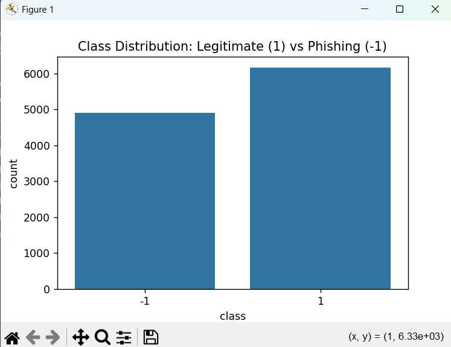
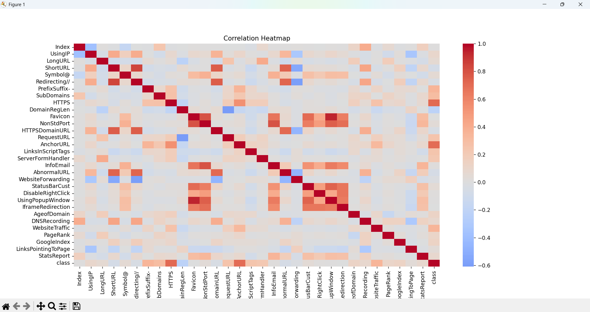
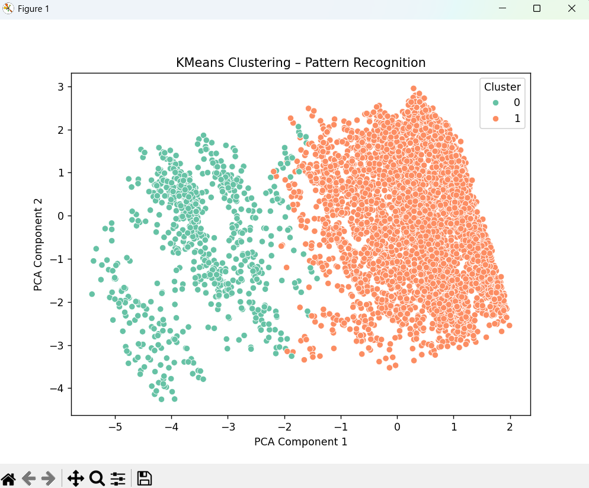

# Phishing Website Detection Report  
**Author:** Abdulrahman Assi  
**ID:** 212371421  

---

## 1️⃣ Description

We chose the **Phishing Website Dataset** from Kaggle because it is directly relevant to cybersecurity — an increasingly important field that affects everyone. This dataset contains features extracted from real websites and aims to classify whether a given website is legitimate or a phishing attempt.

This project is interesting because it shows how various small attributes (like the presence of an IP address, abnormal URLs, or HTTPS usage) can reveal malicious intent. Analyzing these features can help improve digital safety and deepen understanding of online threats.

---

## 2️⃣ System Stage – Phishing Website Dataset

- **File name:** phishing.csv  
- **File size:** Approximately a few MB  
- **File type:** CSV (Comma-Separated Values)  
- **Source:** Kaggle - Phishing Website Detector  
- **Protocol:** Downloaded via HTTPS  
- **Versioning:**  
  - Only one file provided; no formal versions  
  - Project version control is managed via Git  

---

## 3️⃣ Metadata

- **Data Types:**  
  All features are binary (0 or 1), with the target column named `class`:  
  - `1` = legitimate website  
  - `-1` = phishing website  

- **Missing Values:**  
  No missing values were found in this dataset. All rows are complete and usable for modeling.

- **Special Values:**  
  No special placeholder values (like “unknown” or -999) were found. The data is clean and well-formatted for direct use in machine learning.

---
Feature Explanation for Phishing Website Dataset
Feature Name	Description
Index	A unique identifier or serial number for each sample (not used in modeling).
UsingIP	Whether the website URL uses an IP address instead of a domain name (1 = yes, -1 = no). Using IPs in URLs is suspicious.
LongURL	Whether the URL is unusually long (1 = yes, -1 = no). Phishing URLs often use long, confusing URLs.
ShortURL	Whether the URL is suspiciously short (1 = yes, -1 = no). Can be a phishing tactic to hide malicious parts.
Symbol@	Presence of '@' symbol in URL (1 = yes, -1 = no). '@' can be used to redirect URLs, common in phishing.
Redirecting//	Whether the URL contains '//' after the protocol part (1 = yes, -1 = no). Multiple '//' can be suspicious.
PrefixSuffix-	Use of hyphen '-' in the domain name (1 = yes, -1 = no). Phishers often use hyphens to mimic legitimate sites.
SubDomains	Number of subdomains (1 = more subdomains than usual, -1 = normal). Excess subdomains may indicate phishing.
HTTPS	Whether the website uses HTTPS protocol (1 = yes, -1 = no). Legitimate sites usually use HTTPS.
DomainRegLen	Length of domain registration (1 = short registration period, -1 = long). Short registrations can indicate phishing.
Favicon	Whether the favicon is loaded from the same domain (1 = yes, -1 = no). Different favicon sources may be suspicious.
NonStdPort	Use of non-standard port in URL (1 = yes, -1 = no). Non-standard ports can indicate suspicious activity.
HTTPSDomainURL	Whether HTTPS is present in the domain name part of the URL (1 = yes, -1 = no). May indicate deceptive URLs.
RequestURL	Whether resources are loaded from an external domain (1 = yes, -1 = no). External requests can be suspicious.
AnchorURL	Whether anchor tags link to external domains (1 = yes, -1 = no). External anchors can indicate phishing.
LinksInScriptTags	Presence of links inside script tags (1 = yes, -1 = no). This may indicate malicious code.
ServerFormHandler	Whether the form handler is on an external server (1 = yes, -1 = no). External handlers can be suspicious.
InfoEmail	Whether the website contains email information (1 = yes, -1 = no). Phishing sites may provide fake contacts.
AbnormalURL	Whether the URL has abnormalities (1 = yes, -1 = no). Abnormalities can be signs of phishing.
WebsiteForwarding	Whether the website forwards to another URL (1 = yes, -1 = no). Forwarding can be used to hide malicious sites.
StatusBarCust	Whether the status bar is customized (1 = yes, -1 = no). Customization can be used to hide malicious URLs.
DisableRightClick	Whether right-click is disabled (1 = yes, -1 = no). Disabling right-click can prevent inspection of page source.
UsingPopupWindow	Presence of popup windows (1 = yes, -1 = no). Popups are often used in phishing attacks.
IframeRedirection	Use of iframes for redirection (1 = yes, -1 = no). Iframes can hide malicious content.
AgeofDomain	Domain age (1 = young domain, -1 = old). New domains are more suspicious.
DNSRecording	Whether the domain is recorded in DNS (1 = yes, -1 = no). Domains not in DNS may be suspicious.
WebsiteTraffic	Website traffic rank (1 = low traffic, -1 = high). Low traffic can indicate suspicious sites.
PageRank	Page rank of the website (1 = low, -1 = high). Low rank sites may be less trustworthy.
GoogleIndex	Whether the website is indexed by Google (1 = no, -1 = yes). Not indexed sites can be suspicious.
LinksPointingToPage	Number of links pointing to the page (1 = few, -1 = many). Few links can indicate low trust.
StatsReport	Whether there are statistical reports about the site (1 = no, -1 = yes). Lack of reports can be suspicious.
class	Target variable: 1 = legitimate website, -1 = phishing website.

## 4️⃣ Exploratory Data Analysis (EDA)

### Visualization

#### Class Distribution

The dataset exhibits an imbalanced class distribution. Out of 11,054 total samples, approximately 60% represent phishing websites, indicating that phishing samples are the majority class in this dataset.

This imbalance should be considered when training models, as it may affect performance and evaluation metrics.

The class distribution is visualized below:

## 4️⃣ Exploratory Data Analysis (EDA)

### Visualization

#### Class Distribution
---

*(You can continue the EDA section by adding analyses such as feature presence rates, feature correlation heatmaps, and feature distribution differences between classes.)*

---

### Feature Reduction – Correlated Features Removal

During exploratory analysis, we found that the features **`Favicon`** and **`UsingPopupWindow`** are highly correlated, meaning they provide overlapping information to the model.

To reduce redundancy and simplify the feature set, we removed these two features from the dataset.

Removing correlated features helps prevent overfitting and reduces noise, improving model interpretability and performance.

The final feature set used for modeling excludes `Favicon` and `UsingPopupWindow`, resulting in a more concise and effective dataset.

---
### Outlier Detection

To identify anomalous samples that may distort our model, we used **Isolation Forest**, a robust unsupervised outlier detection algorithm. Based on feature patterns, approximately **1%** of samples were flagged as outliers.

These samples exhibited combinations of binary features that significantly deviated from the typical behavior of either legitimate or phishing websites.

| Metric              | Count |
|---------------------|-------|
| Original Samples    | 11,054 |
| Outliers Removed    | 108    |
| Final Sample Size   |  10946 |

### Pattern Recognition via Clustering

To uncover hidden behavioral patterns in the dataset, we applied **KMeans Clustering** (with 2 clusters) to the feature set.

Although the dataset includes labels (phishing vs legitimate), we used clustering in an unsupervised way to validate whether websites naturally group by behavior.

The data was then reduced to 2D using **PCA (Principal Component Analysis)** for visualization.

**Observation:**
- The clusters showed partially distinct groupings.
- This confirms that legitimate and phishing websites often exhibit separable behavior patterns even without supervision.

This kind of pattern recognition helps validate feature quality and can inform the design of anomaly-based detection systems.

### Time Series Analysis

Time series analysis typically involves examining how data changes over time to identify trends, spikes, or irregularities. This can be particularly valuable for monitoring patterns in phishing activity, such as sudden increases in malicious website reports or seasonal behavior.

However, the dataset used in this project does **not include any time-related feature** (e.g., timestamps or collection dates). As a result, a true time series analysis could not be performed.

In future versions of this dataset, the inclusion of time-based attributes would enable deeper insights into the temporal behavior of phishing threats.
